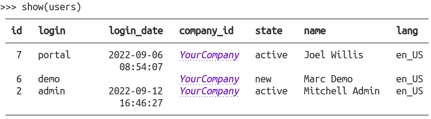

# Odoo Show 🔎️

Odoo Show is a python library that uses [`rich`](https://github.com/Textualize/rich) to
give you goggles when you're diving into the Odoo Shell.

Basic usage:

```python
from odooshow import show

partners = env["res.partner"].search([])  # Any recordset will do
show(partners)
```

This would be the output:



A small demo with the common usage of its features:

[](https://asciinema.org/a/525597)

## Installation

You'll need `rich` and `odoo`.

To install with pip, simply:

```bash
pip install odooshow
```

## Known issues

- Better support for OdooRPC.

## Roadmap

- Make an Odoo module so we can plug the funcionality directly into the model abstract.
- Configurable column totals. Now we're getting them from the field info.
